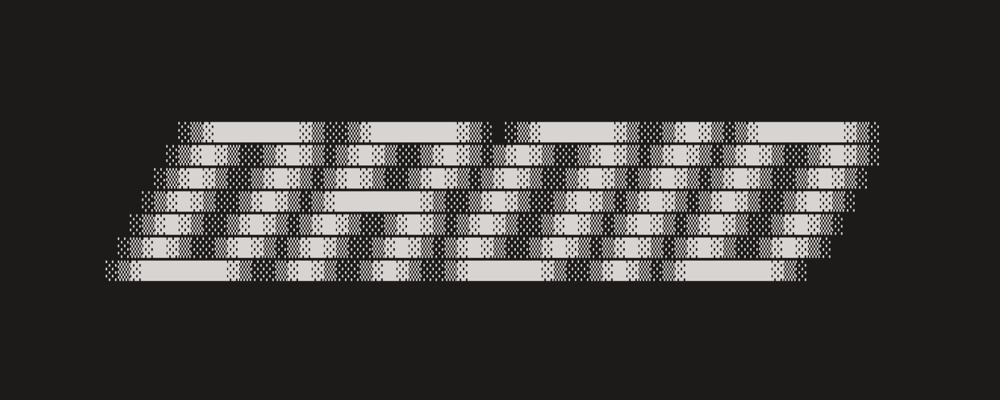

# Factory

The agent-native development platform. Works across CLI, Web, Slack/Teams, Linear/Jira and Mobile.

Our agent, Droid, is top performing in terminal benchmarks.

  

<strong>The agent-native development platform built for shipping software faster.</strong>

## Getting Started

- [CLI Quickstart](https://docs.factory.ai/cli/getting-started/quickstart)
- [VS Code Extension](https://marketplace.visualstudio.com/items?itemName=Factory.factory-vscode-extension)

## Quick Links

- [Factory Website](https://factory.ai)
- [Documentation](https://docs.factory.ai)
- [CLI Overview](https://docs.factory.ai/cli/getting-started/overview)
- [Community Builds](./community-builds.md)

## Community & Contributions

- Join the community on [GitHub Discussions](https://github.com/Factory-AI/factory/discussions)
- Share your workflows by opening a PR against [`community-builds.md`](./community-builds.md)
- Bug/issue/feature request? [Open an issue](https://github.com/Factory-AI/factory/issues) or send a pull request

## Community Builds

- [here-now](https://github.com/fredrivett/here-now) — Minimal webpage hit counter by [fredrivett](https://github.com/fredrivett)
- [factory-mcp](https://github.com/iannuttall/factory-mcp) — Factory MCP integration demos by [iannuttall](https://github.com/iannuttall)

## License

Copyright © 2025 Factory AI. All rights reserved.
