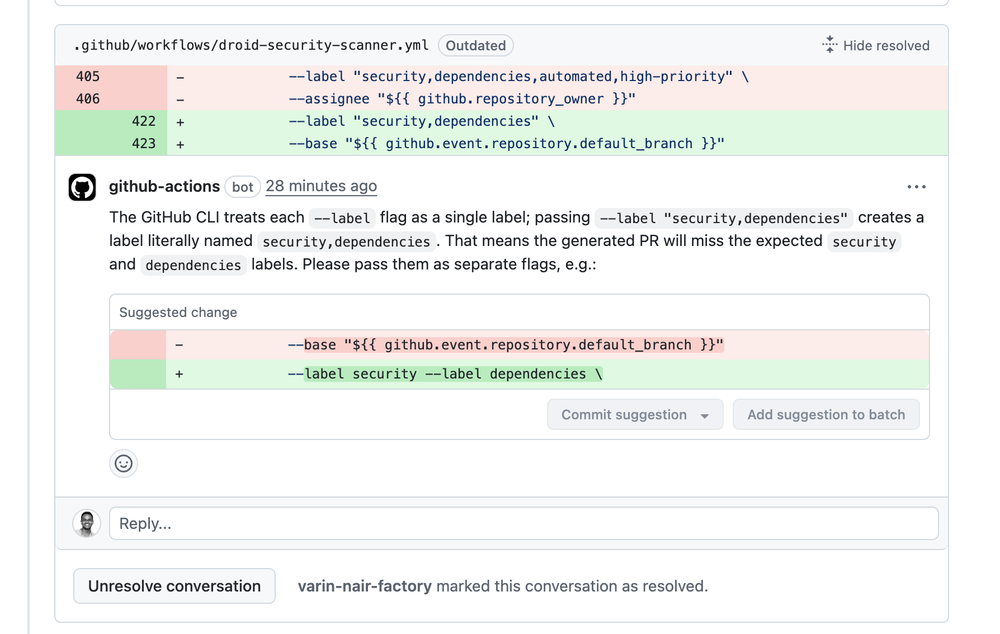
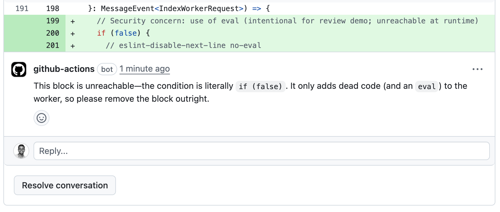

This tutorial shows you how to set up automated code review using Droid Exec in GitHub Actions. The workflow will analyze pull requests, identify issues, and post feedback as inline comments.

<Info>
Unlike interactive CLI sessions, Droid Exec runs in headless mode, making it perfect for CI/CD automation. The agent analyzes code changes, identifies issues, and creates structured output that can be posted as PR comments.
</Info>

## How it works

The workflow:

1.  Triggers on pull request events
2.  Checks out the PR and installs the Droid CLI
3.  Configures git identity and prepares review context files
4.  Runs Droid Exec to analyze the diff and produce review comments
5.  Submits inline comments or a summary, uploading debug artifacts on failure

<div style={{ display: 'flex', gap: '1rem', flexWrap: 'wrap' }}>
  <div style={{ flex: '1', minWidth: '300px' }}>
    
  </div>
  <div style={{ flex: '1', minWidth: '300px' }}>
    
  </div>
</div>

<Accordion title="Full Workflow File">
````yaml
name: Droid Code Review

on:
  pull_request:
    types: [opened, synchronize, reopened, ready_for_review]

concurrency:
  group: droid-review-${{ github.event.pull_request.number }}
  cancel-in-progress: true

permissions:
  pull-requests: write
  contents: read
  issues: write

jobs:
  code-review:
    runs-on: ubuntu-latest
    timeout-minutes: 15
    # Skip automated code review for draft PRs
    if: github.event.pull_request.draft == false

    steps:
      - name: Checkout repository
        uses: actions/checkout@v4
        with:
          fetch-depth: 0
          ref: ${{ github.event.pull_request.head.sha }}

      - name: Install Droid CLI
        run: |
          curl -fsSL https://app.factory.ai/cli | sh
          echo "$HOME/.local/bin" >> $GITHUB_PATH
          "$HOME/.local/bin/droid" --version

      - name: Configure git identity
        run: |
          git config user.name "Droid Agent"
          git config user.email "droidagent@factory.ai"

      - name: Prepare review context
        run: |
          # Get the PR diff
          git fetch origin ${{ github.event.pull_request.base.ref }}
          git diff origin/${{ github.event.pull_request.base.ref }}...${{ github.event.pull_request.head.sha }} > diff.txt

          # Get existing comments using GitHub API
          curl -H "Authorization: token ${{ secrets.GITHUB_TOKEN }}" \
               -H "Accept: application/vnd.github.v3+json" \
               "https://api.github.com/repos/${{ github.repository }}/issues/${{ github.event.pull_request.number }}/comments" \
               > existing_comments.json

          # Get changed files with patches for positioning
          curl -H "Authorization: token ${{ secrets.GITHUB_TOKEN }}" \
               -H "Accept: application/vnd.github.v3+json" \
               "https://api.github.com/repos/${{ github.repository }}/pulls/${{ github.event.pull_request.number }}/files" \
               | jq '[.[] | {filename: .filename, patch: .patch}]' > files.json

      - name: Perform automated code review
        env:
          FACTORY_API_KEY: ${{ secrets.FACTORY_API_KEY }}
          GH_TOKEN: ${{ secrets.GITHUB_TOKEN }}
        run: |
          cat > prompt.txt << 'EOF'
          You are an automated code review system. Review the PR diff and identify clear issues that need to be fixed.

          Input files (already in current directory):
          - diff.txt: the code changes to review
          - files.json: file patches with line numbers for positioning comments
          - existing_comments.json: skip issues already mentioned here

          Task: Create a file called comments.json with this exact format:
          [{ "path": "path/to/file.js", "position": 42, "body": "Your comment here" }]

          Focus on these types of issues:
          - Dead/unreachable code (if (false), while (false), code after return/throw/break)
          - Broken control flow (missing break in switch, fallthrough bugs)
          - Async/await mistakes (missing await, .then without return, unhandled promise rejections)
          - Array/object mutations in React components or reducers
          - UseEffect dependency array problems (missing deps, incorrect deps)
          - Incorrect operator usage (== vs ===, && vs ||, = in conditions)
          - Off-by-one errors in loops or array indexing
          - Integer overflow/underflow in calculations
          - Regex catastrophic backtracking vulnerabilities
          - Missing base cases in recursive functions
          - Incorrect type coercion that changes behavior
          - Environment variable access without defaults or validation
          - Null/undefined dereferences
          - Resource leaks (unclosed files or connections)
          - SQL/XSS injection vulnerabilities
          - Concurrency/race conditions
          - Missing error handling for critical operations

          Comment format:
          - Clearly describe the issue: "This code block is unreachable due to the if (false) condition"
          - Provide a concrete fix: "Remove this entire if block as it will never execute"
          - When possible, suggest the exact code change:
            ```suggestion
            // Remove the unreachable code
            ```
          - Be specific about why it's a problem: "This will cause a TypeError if input is null"
          - No emojis, just clear technical language

          Skip commenting on:
          - Code style, formatting, or naming conventions
          - Minor performance optimizations
          - Architectural decisions or design patterns
          - Features or functionality (unless broken)
          - Test coverage (unless tests are clearly broken)

          Position calculation:
          - Use the "position" field from files.json patches
          - This is the line number in the diff, not the file
          - Comments must align with exact changed lines only

          Output: 
          - Empty array [] if no issues found
          - Otherwise array of comment objects with path, position, body
          - Each comment should be actionable and clear about what needs to be fixed
          - Maximum 10 comments total; prioritize the most critical issues
          EOF

          # Run droid exec with the prompt
          echo "Running code review analysis..."
          droid exec --auto high -f prompt.txt

          # Check if comments.json was created
          if [ ! -f comments.json ]; then
            echo "❌ ERROR: droid exec did not create comments.json"
            echo "This usually indicates the review run failed (e.g. missing FACTORY_API_KEY or runtime error)."
            exit 1
          fi

          echo "=== Review Results ==="
          cat comments.json

      - name: Submit inline review comments
        uses: actions/github-script@v7
        with:
          script: |
            const fs = require('fs');
            const prNumber = context.payload.pull_request.number;

            if (!fs.existsSync('comments.json')) {
              core.info('comments.json missing; skipping review submission');
              return;
            }

            const comments = JSON.parse(fs.readFileSync('comments.json', 'utf8'));

            if (!Array.isArray(comments) || comments.length === 0) {
              // Check if we already have a "no issues" comment
              const existing = await github.paginate(github.rest.issues.listComments, {
                owner: context.repo.owner,
                repo: context.repo.repo,
                issue_number: prNumber,
                per_page: 100
              });
              
              const hasNoIssuesComment = existing.some(c => 
                c.user.login.includes('[bot]') && 
                /no issues found|lgtm|✅/i.test(c.body || '')
              );
              
              if (!hasNoIssuesComment) {
                await github.rest.pulls.createReview({
                  owner: context.repo.owner,
                  repo: context.repo.repo,
                  pull_number: prNumber,
                  event: 'COMMENT',
                  body: '✅ No issues found in the current changes.'
                });
              }
              return;
            }

            // Submit review with inline comments
            const summary = `Found ${comments.length} potential issue${comments.length === 1 ? '' : 's'} that should be addressed.`;

            await github.rest.pulls.createReview({
              owner: context.repo.owner,
              repo: context.repo.repo,
              pull_number: prNumber,
              event: 'COMMENT',
              body: summary,
              comments: comments
            });

            core.info(`Submitted review with ${comments.length} inline comments`);

      - name: Upload debug artifacts on failure
        if: ${{ failure() }}
        uses: actions/upload-artifact@v4
        with:
          name: droid-review-debug-${{ github.run_id }}
          path: |
            diff.txt
            files.json
            existing_comments.json
            prompt.txt
            comments.json
            ${{ runner.home }}/.factory/logs/droid-log-single.log
            ${{ runner.home }}/.factory/logs/console.log
          if-no-files-found: ignore
          retention-days: 7
````
</Accordion>

## Prerequisites

<Steps>
  <Step title="GitHub Repository">
    Ensure you have a GitHub repository with Actions enabled
  </Step>
  
  <Step title="Get Factory API Key">
    Generate your API key from the [Factory Settings Page](https://app.factory.ai/settings/api-keys)
  </Step>
  
  <Step title="GitHub Actions Knowledge">
    Basic understanding of GitHub Actions workflows
  </Step>
</Steps>

## Configure authentication

Add your Factory API key as a repository secret:

1.  Go to your repository's Settings → Secrets and variables → Actions
2.  Click "New repository secret"
3.  Name: `FACTORY_API_KEY`
4.  Value: Your Factory API key (starts with `fk-`)

## Build the GitHub Actions workflow

Let's build the workflow step by step to understand each component.

### Set up the workflow trigger

Create `.github/workflows/droid-code-review.yml` and configure when it should run:

```yaml
name: Droid Code Review

on:
  pull_request:
    types: [opened, synchronize, reopened, ready_for_review]

concurrency:
  group: droid-review-${{ github.event.pull_request.number }}
  cancel-in-progress: true
```

The `concurrency` group ensures only one review runs per PR at a time, canceling outdated runs when new commits are pushed.

### Configure workflow permissions

Define the top-level permissions and job details used by the workflow:

```yaml
permissions:
  pull-requests: write
  contents: read
  issues: write

jobs:
  code-review:
    runs-on: ubuntu-latest
    timeout-minutes: 15

    # Skip draft PRs to avoid noise during development
    if: github.event.pull_request.draft == false

```

### Checkout the repository

Add the checkout step to access the PR code:

```yaml
    steps:
      - name: Checkout repository
        uses: actions/checkout@v4
        with:
          fetch-depth: 0  # Full history for accurate diffs
          ref: ${{ github.event.pull_request.head.sha }}
```

### Install Droid CLI

Install the Factory Droid CLI in the runner:

```yaml
      - name: Install Droid CLI
        run: |
          curl -fsSL https://app.factory.ai/cli | sh
          echo "$HOME/.local/bin" >> $GITHUB_PATH
          "$HOME/.local/bin/droid" --version
```

### Configure git identity

Set the git username and email so review comments originate from the expected bot account:

```yaml
      - name: Configure git identity
        run: |
          git config user.name "Droid Agent"
          git config user.email "droidagent@factory.ai"
```

### Prepare review context

Gather the diff, existing comments, and file patches that Droid Exec will analyze:

```yaml
      - name: Prepare review context
        run: |
          # Get the PR diff
          git fetch origin ${{ github.event.pull_request.base.ref }}
          git diff origin/${{ github.event.pull_request.base.ref }}...${{ github.event.pull_request.head.sha }} > diff.txt

          # Get existing comments using GitHub API
          curl -H "Authorization: token ${{ secrets.GITHUB_TOKEN }}" \
               -H "Accept: application/vnd.github.v3+json" \
               "https://api.github.com/repos/${{ github.repository }}/issues/${{ github.event.pull_request.number }}/comments" \
               > existing_comments.json

          # Get changed files with patches for positioning
          curl -H "Authorization: token ${{ secrets.GITHUB_TOKEN }}" \
               -H "Accept: application/vnd.github.v3+json" \
               "https://api.github.com/repos/${{ github.repository }}/pulls/${{ github.event.pull_request.number }}/files" \
               | jq '[.[] | {filename: .filename, patch: .patch}]' > files.json
```

### Run the automated review

Craft a detailed prompt and execute Droid Exec to produce inline comments. The command relies on both `FACTORY_API_KEY` and `GITHUB_TOKEN` secrets:

````yaml
      - name: Perform automated code review
        env:
          FACTORY_API_KEY: ${{ secrets.FACTORY_API_KEY }}
          GH_TOKEN: ${{ secrets.GITHUB_TOKEN }}
        run: |
          cat > prompt.txt << 'EOF'
          You are an automated code review system. Review the PR diff and identify clear issues that need to be fixed.

          Input files (already in current directory):
          - diff.txt: the code changes to review
          - files.json: file patches with line numbers for positioning comments
          - existing_comments.json: skip issues already mentioned here

          Task: Create a file called comments.json with this exact format:
          [{ "path": "path/to/file.js", "position": 42, "body": "Your comment here" }]

          Focus on these types of issues:
          - Dead/unreachable code (if (false), while (false), code after return/throw/break)
          - Broken control flow (missing break in switch, fallthrough bugs)
          - Async/await mistakes (missing await, .then without return, unhandled promise rejections)
          - Array/object mutations in React components or reducers
          - UseEffect dependency array problems (missing deps, incorrect deps)
          - Incorrect operator usage (== vs ===, && vs ||, = in conditions)
          - Off-by-one errors in loops or array indexing
          - Integer overflow/underflow in calculations
          - Regex catastrophic backtracking vulnerabilities
          - Missing base cases in recursive functions
          - Incorrect type coercion that changes behavior
          - Environment variable access without defaults or validation
          - Null/undefined dereferences
          - Resource leaks (unclosed files or connections)
          - SQL/XSS injection vulnerabilities
          - Concurrency/race conditions
          - Missing error handling for critical operations

          Comment format:
          - Clearly describe the issue: "This code block is unreachable due to the if (false) condition"
          - Provide a concrete fix: "Remove this entire if block as it will never execute"
          - When possible, suggest the exact code change:
            ```suggestion
            // Remove the unreachable code
            ```
          - Be specific about why it's a problem: "This will cause a TypeError if input is null"
          - No emojis, just clear technical language

          Skip commenting on:
          - Code style, formatting, or naming conventions
          - Minor performance optimizations
          - Architectural decisions or design patterns
          - Features or functionality (unless broken)
          - Test coverage (unless tests are clearly broken)

          Position calculation:
          - Use the "position" field from files.json patches
          - This is the line number in the diff, not the file
          - Comments must align with exact changed lines only

          Output: 
          - Empty array [] if no issues found
          - Otherwise array of comment objects with path, position, body
          - Each comment should be actionable and clear about what needs to be fixed
          - Prioritize the most critical issues
          EOF

          echo "Running code review analysis..."
          droid exec --auto high -f prompt.txt

          if [ ! -f comments.json ]; then
            echo "❌ ERROR: droid exec did not create comments.json"
            echo "This usually indicates the review run failed (e.g. missing FACTORY_API_KEY or runtime error)."
            exit 1
          fi

          echo "=== Review Results ==="
          cat comments.json
````

### Submit review comments

Use `actions/github-script` to post inline feedback or a fallback summary based on the generated `comments.json`:

```yaml
      - name: Submit inline review comments
        uses: actions/github-script@v7
        with:
          script: |
            const fs = require('fs');
            const prNumber = context.payload.pull_request.number;

            if (!fs.existsSync('comments.json')) {
              core.info('comments.json missing; skipping review submission');
              return;
            }

            const comments = JSON.parse(fs.readFileSync('comments.json', 'utf8'));

            if (!Array.isArray(comments) || comments.length === 0) {
              // Check if we already have a "no issues" comment
              const existing = await github.paginate(github.rest.issues.listComments, {
                owner: context.repo.owner,
                repo: context.repo.repo,
                issue_number: prNumber,
                per_page: 100
              });
              
              const hasNoIssuesComment = existing.some(c => 
                c.user.login.includes('[bot]') && 
                /no issues found|lgtm|✅/i.test(c.body || '')
              );
              
              if (!hasNoIssuesComment) {
                await github.rest.pulls.createReview({
                  owner: context.repo.owner,
                  repo: context.repo.repo,
                  pull_number: prNumber,
                  event: 'COMMENT',
                  body: '✅ No issues found in the current changes.'
                });
              }
              return;
            }

            // Submit review with inline comments
            const summary = `Found ${comments.length} potential issue${comments.length === 1 ? '' : 's'} that should be addressed.`;

            await github.rest.pulls.createReview({
              owner: context.repo.owner,
              repo: context.repo.repo,
              pull_number: prNumber,
              event: 'COMMENT',
              body: summary,
              comments: comments
            });

            core.info(`Submitted review with ${comments.length} inline comments`);
```

### Save artifacts on failure

Store review artifacts for troubleshooting if the workflow fails:

```yaml
      - name: Upload debug artifacts on failure
        if: ${{ failure() }}
        uses: actions/upload-artifact@v4
        with:
          name: droid-review-debug-${{ github.run_id }}
          path: |
            diff.txt
            files.json
            existing_comments.json
            prompt.txt
            comments.json
            ${{ runner.home }}/.factory/logs/droid-log-single.log
            ${{ runner.home }}/.factory/logs/console.log
          if-no-files-found: ignore
          retention-days: 7
```


## Test your reviewer

Create a test PR with some intentional issues to verify the workflow:

```javascript
// Example code with issues
function processData(data) {
  if (false) {  // Dead code
    console.log("This never runs");
  }
  
  data.forEach(async item => {  // Missing await
    processItem(item);
  });
  
  if (data = null) {  // Changed assignment to comparison
    return;
  }
}
```

The reviewer should identify these issues and post inline comments.
