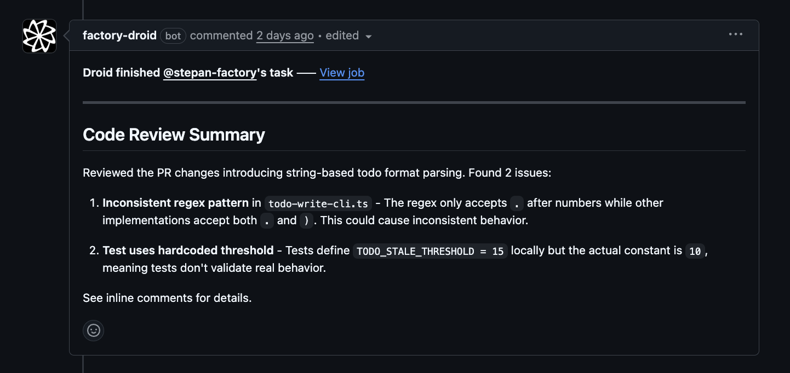
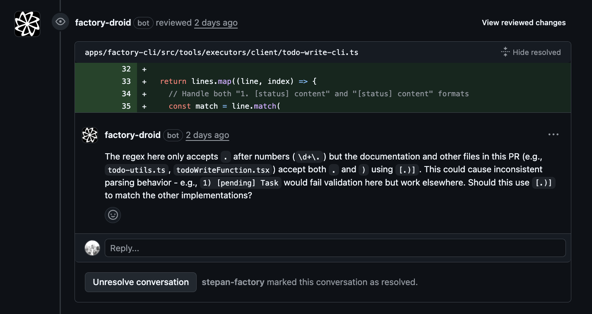

Set up automated code review for GitHub or GitLab repositories. Droid analyzes pull requests and merge requests, identifies issues, and posts feedback as inline comments. For GitHub repositories, the setup flow checks the Factory Droid GitHub App installation as part of configuring review automation.

<div style={{ display: 'flex', gap: '1rem', flexWrap: 'wrap' }}>
  <div style={{ flex: '1', minWidth: '300px' }}>
    
  </div>
  <div style={{ flex: '1', minWidth: '300px' }}>
    
  </div>
</div>

## Setup

Use the `/install-code-review` command to set up automated code review for GitHub or GitLab:

```bash
droid
> /install-code-review
```

The guided flow will:
1. Detect your SCM platform (GitHub or GitLab)
2. Verify prerequisites (CLI tools, permissions)
3. Walk you through review configuration (depth, security, triggers)
4. Create a PR/MR with the workflow files

## How it works

Once enabled, the Droid Review workflow:

1. Triggers on pull request events (opened, synchronize, reopened, ready for review)
2. Skips draft PRs to avoid noise during development
3. Fetches the PR diff and existing comments
4. Analyzes code changes for bugs, security issues, and correctness problems
5. Posts inline comments on problematic lines
6. Submits an approval when no issues are found

## Authentication

Automated review needs two separate kinds of access: permission to run Droid, and permission to post on your pull requests. You set them up independently.

### 1. Factory API key (run Droid)

Droid runs using your Factory API key. Create one at [app.factory.ai/settings/api-keys](https://app.factory.ai/settings/api-keys), then add it to your repository or organization as a secret named `FACTORY_API_KEY`. The workflow passes it in like this:

```yaml
- uses: Factory-AI/droid-action@main
  with:
    factory_api_key: ${{ secrets.FACTORY_API_KEY }}
```

This is required for every run.

### 2. GitHub access (post reviews)

To leave comments and approvals on your PRs, Droid needs a GitHub token. There are two ways to provide one:

- **Factory Droid GitHub App (default, recommended).** If you don't supply a token, the action securely requests one for the installed Factory Droid GitHub App. For most teams this is all you need: install the app on your repositories from [app.factory.ai/settings/organization](https://app.factory.ai/settings/organization) and you're done. It requires the `id-token: write` permission so the action can request the token:

  ```yaml
  permissions:
    contents: write
    pull-requests: write
    issues: write
    id-token: write # required for GitHub App auth
  ```

- **Your own token (override).** If you'd rather use a personal access token or your own GitHub App, for example on GitHub Enterprise or to control which account posts comments, pass it as `github_token`. When set, Droid uses it directly and skips the app. The token needs write access to pull requests and repository contents.

  ```yaml
  - uses: Factory-AI/droid-action@main
    with:
      factory_api_key: ${{ secrets.FACTORY_API_KEY }}
      github_token: ${{ secrets.MY_GITHUB_TOKEN }}
  ```

<Note>
  On GitLab, the same two pieces apply: set `FACTORY_API_KEY` and `GITLAB_TOKEN` as CI/CD variables. The `/install-code-review` flow configures both for you.
</Note>

For the security architecture behind the GitHub App, see [GitHub Integration Security](/enterprise/github-integration-security).

## Review depth

The `review_depth` input is the only setting you need to choose how reviews run. You pick the depth during `/install-code-review` setup, or set it directly in your workflow.

- **`deep`** (default) — Thorough analysis with higher reasoning effort. Catches more subtle bugs but costs more per review. Best for production code and security-sensitive repos.
- **`shallow`** — Faster, more cost-effective reviews that cover surface-level issues. Good for high-volume repos, draft PRs, or teams watching spend.

```yaml
with:
  automatic_review: true
  review_depth: deep  # or shallow
```

Each preset picks the model and reasoning effort for you, and Factory keeps it on its recommended model as new models ship. Your reviews get upgrades without editing the workflow or updating `droid-action`. We recommend using a preset rather than choosing a model yourself.

<Note>
  If your workflow sets `review_model`, `security_model`, or `reasoning_effort` from an earlier setup, remove them so reviews follow the preset and stay current.
</Note>

<Accordion title="Advanced: model overrides">
  Only needed if your organization requires a specific model provider. The `review_model`, `security_model`, `fill_model`, and `reasoning_effort` inputs take priority over the depth preset.

  If you set a model, use a provider tier alias. Factory keeps each alias on its recommended model for that provider and tier, so your reviews still pick up new models automatically. An alias stays in the same price tier when its model changes.

  | Provider | Aliases |
  | --- | --- |
  | OpenAI | `openai-latest-premium`, `openai-latest-balanced`, `openai-latest-fast` |
  | Anthropic | `anthropic-latest-premium`, `anthropic-latest-balanced`, `anthropic-latest-fast` |
  | Open-weight models | `oss-latest-premium`, `oss-latest-balanced`, `oss-latest-fast` |

  ```yaml
  with:
    automatic_review: true
    review_model: anthropic-latest-balanced
  ```

  Your organization's model policy is checked against the model an alias currently resolves to. If that model is not allowed, Droid falls back to your organization's default model and says so in the tracking comment.

  Exact model IDs are also accepted, but they never upgrade on their own, so reviews stay on that model until you edit the workflow. We do not recommend them.
</Accordion>

## Security review

Security review is a dedicated workflow for STRIDE, OWASP, OWASP LLM Top 10, and supply-chain analysis. See [Security Review](/enterprise/security-review) for automatic PR security reviews, scheduled scans, and local full-codebase audits with the built-in `security-review` skill.

## What Droid reviews

The automated reviewer focuses on clear bugs and issues:

- Dead/unreachable code
- Broken control flow (missing break, fallthrough bugs)
- Async/await mistakes
- Null/undefined dereferences
- Resource leaks
- SQL/XSS injection vulnerabilities
- Missing error handling
- Off-by-one errors
- Race conditions

It skips stylistic concerns, minor optimizations, and architectural opinions.

## Customizing the workflow

After the workflow is created, you can customize it by editing `.github/workflows/droid-review.yml` in your repository.

### Change the trigger conditions

Modify when reviews run:

```yaml
on:
  pull_request:
    types: [opened, synchronize, reopened, ready_for_review]
    paths:
      - 'src/**'  # Only review changes in src/
      - '!**/*.test.ts'  # Skip test files
```

### Custom review guidelines

Add repository-specific review guidelines by creating a `.factory/skills/review-guidelines/SKILL.md` file in your repo:

```markdown
<!-- .factory/skills/review-guidelines/SKILL.md -->

Additional checks for this codebase:
- React hooks rules violations
- Missing TypeScript types on public APIs
- Prisma query performance issues
```

These guidelines are automatically picked up and injected into every review run. No workflow changes needed.

### Skip certain PRs

Add conditions to skip reviews for specific cases:

```yaml
jobs:
  code-review:
    # Skip bot PRs and PRs with [skip-review] in title
    if: |
      github.event.pull_request.draft == false &&
      !contains(github.event.pull_request.user.login, '[bot]') &&
      !contains(github.event.pull_request.title, '[skip-review]')
```

### Limit comment count

Adjust the maximum number of comments in the prompt:

```
Guidelines:
- Submit at most 5 comments total, prioritizing the most critical issues
```

## All workflow inputs

| Input | Default | Description |
|-------|---------|-------------|
| `automatic_review` | `false` | Automatically review PRs without `@droid review` |
| `review_depth` | `deep` | Review preset: `deep` (thorough) or `shallow` (fast). See [Review depth](#review-depth). |
| `include_suggestions` | `true` | Include code suggestion blocks in comments |

Security review inputs are documented in [Security Review](/enterprise/security-review#configuration).

## See also

- [Security Review](/enterprise/security-review) - Security-focused PR reviews and full-codebase audits
- [GitHub Integration Security](/enterprise/github-integration-security) - Security architecture for the GitHub App integration
- [GitHub Actions examples](/guides/droid-exec/github-actions) - More automation workflows
- [Droid Exec](/cli/droid-exec/overview) - Running Droid in CI/CD environments
